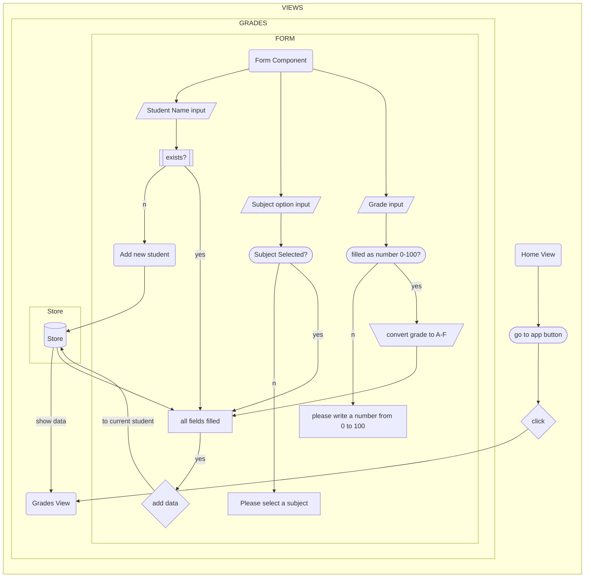

<details><summary>Using Vue</summary>

# teacher-grades

This website is made with Vue 3

## Project Setup

```sh
npm install
```

### Compile and Hot-Reload for Development

```sh
npm run dev
```

### Compile and Minify for Production

```sh
npm run build
```

### Run Unit Tests with [Vitest](https://vitest.dev/)

```sh
npm run test:unit
```

### Lint with [ESLint](https://eslint.org/)

```sh
npm run lint
```

</details>

<details><summary>User Flow</summary>
 

  
</details>
